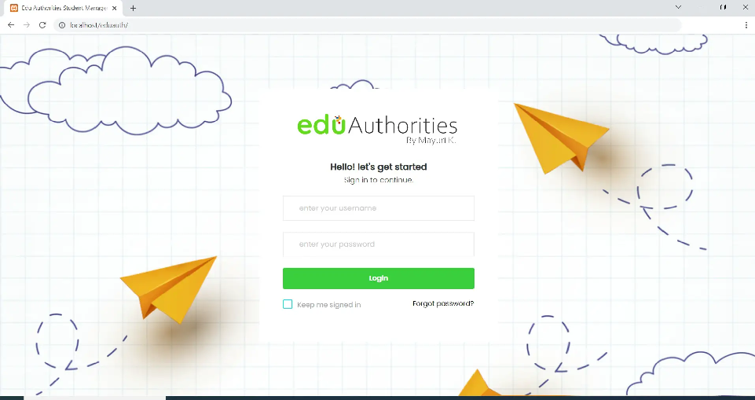

# StudentManage
A student management system is a web-based application that allows educational institutions to manage their students, faculty, staff, and other resources

# Info
A student management system is a web-based application that allows educational institutions to manage their students, faculty, staff, and other resources. It provides an efficient way to keep track of student data and records, as well as manage student activities such as attendance and grades. The system also helps with administrative tasks such as creating class schedules and managing finances.

# How does it work
Download source code (zip file) of student management system project with SQL file.
Extract the file of the project folder (zip file) related to the eduauth
Copy project folder i.e source code files to htdocs
open localhost/phpmyadmin and create a database (remember PHP version must be a minimum of 7.1)
Now import the database of the SQL file
Open source code files and check database name is proper or not.
Now open the admin panel and log in with provided credentials.

   
